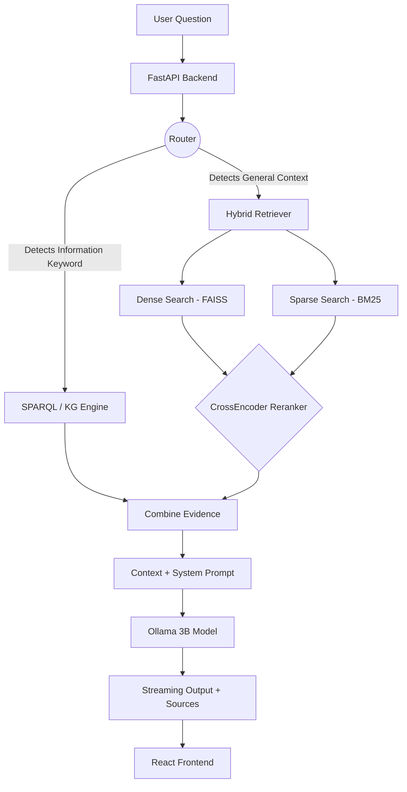

# 🎓 NexRag: Viva & Presentation Preparation Guide

This intelligence package is designed specifically to help you master the **NexRag** project context for your final year project presentation and viva voce.

> [!TIP]
> **Elevator Pitch:** NexRag is a local-first, hybrid academic assistant for MESITAM. It uniquely bridges structured data (Knowledge Graphs) and unstructured data (Seminars/Rules PDFs) through a Hybrid RAG pipeline, providing explainable, grounded, and privacy-preserving answers using local LLMs.

---

## 1. Core Architecture & Tech Stack

Be prepared to quickly rattle off your technology stack. Interviewers look for your understanding of *why* a technology was chosen.

| Layer | Technology | "Why did you choose this?" |
|---|---|---|
| **Frontend** | React + Vite + TypeScript | "We wanted a highly interactive, fast, and modern UI. The component-based structure allowed us to separate chat, intelligence panel, and KG editor." |
| **Backend API** | FastAPI (Python) | "FastAPI provides asynchronous execution and automatic API documentation. It's the standard for modern Python machine learning pipelines." |
| **Dense Search** | FAISS + `all-MiniLM-L6-v2` | "FAISS is extremely fast for nearest-neighbor search. MiniLM is lightweight but accurate enough for embedding PDF chunks on typical institutional hardware." |
| **Sparse Search** | BM25 (`rank_bm25`) | "Embeddings sometimes miss exact keywords (like specific course codes or regulation names). BM25 complements dense search by finding exact lexical matches." |
| **Reranking** | CrossEncoder (`ms-marco-MiniLM...`) | "Dual-encoders (FAISS) are fast but lose nuance. Cross-encoders look at the query and text *together* to properly rank relevance. We use it only on top candidates to save computation." |
| **Knowledge Graph** | RDF/Turtle + Apache Jena Fuseki | "Standardizing on RDF allowed us to use SPARQL for strict, relational queries (e.g., 'who teaches course X'). Fuseki provides a robust local endpoint." |
| **Local LLM** | Ollama + `llama3.2:3b` | "To ensure institutional privacy, avoid cloud API costs, and guarantee the RAG constraint—the LLM is forced to only answer from provided context." |

---

## 2. System Workflow: What happens when a user asks a question?

You can explicitly describe or draw this workflow during your presentation.

---

## 3. Top 10 Viva Questions & Winning Answers

Review these frequently asked generic and technical viva questions. 

### Q1: What is "Hybrid RAG", and why is it better than standard RAG?
**Answer:** Standard RAG usually implies just creating embeddings (vectors) of documents and doing a similarity search. NexRag is "Hybrid" in two ways: 
1. We combine **vector search with a Knowledge Graph**. 
2. Inside the vector search, we use a hybrid of **Dense (Semantic) search** and **Sparse (Keyword/BM25) search**. 
This is better because standard RAG struggles with exact facts/relations (e.g., "Which faculty is HOD of CS?"), whereas our Hybrid approach catches exact relationships reliably while still being able to summarize long handbook rules.

### Q2: Why did you use a Knowledge Graph instead of just dumping all data into vector embeddings?
**Answer:** Because vector similarity fails at strict relational queries. If I ask "Who teaches C Programming?", an embedding system might just return chunks mentioning both "C Programming" and random "Faculty". A Knowledge Graph (RDF/Turtle) stores exact explicit relationships `(Entity) -> (Relation) -> (Entity)`, allowing us to run an exact SPARQL query to get the mathematically correct answer.

### Q3: How does your query Router work? Did you use a Machine Learning classifier?
**Answer:** No, our router is rule-based and lightweight, utilizing keyword extraction and intent categories (e.g., `FACULTY_INFO`, `REGULATION`). In an academic institution, user queries follow highly predictable patterns. A rule-based router avoids the hardware overhead and latency of a machine-learning text classification model while giving us explicit, interpretable control over where the query routes.

### Q4: Can you explain the Retrieval Algorithm?
**Answer:** 
1. We map the question to a vector query. 
2. We grab an expanded candidate list of chunks using **L2 Distance via FAISS**. 
3. We grab lexically matched chunks using the **BM25 algorithm**. 
4. We unite these candidates into one pool. 
5. Finally, we evaluate every candidate *jointly* with the user's question using a **Cross-Encoder Model** and normalize these scores via a **sigmoid function**. Only the top chunks passing the threshold are sent to the LLM.

### Q5: How do you prevent "Hallucinations"?
**Answer:** Two main ways. First, our system architecture doesn't just ask the LLM to 'answer' a question—it binds it to the retrieved context. Our **System Prompt** explicitly instructs the LLM to output "I don't have enough information" if the answer isn't in the provided text. Second, our frontend presents **Evidence snippets** and a computed **Confidence Score**, allowing the user to trace the origin of the answer.

### Q6: Why did you choose Ollama/Llama-3.2 locally over an API like OpenAI/GPT-4?
**Answer:** We wanted our system to be **"Local-First"**. For an educational institution, privacy of data is critical, as is maintaining zero recurring subscription costs for inference. Llama-3.2 3B is lightweight enough to run smoothly on local hardware while remaining perfectly capable of summarizing RAG evidence contextually.

### Q7: If I add a new PDF, does the model need to be retrained?
**Answer:** **No, that is the beauty of RAG.** The LLM weights are frozen. When a new PDF is added, our script (`pdfplumber`) extracts the text, breaks it into overlapping chunks, generates new vectors, and updates the FAISS index database. The LLM simply reads the new chunks when they are retrieved as context. 

### Q8: How does your system compute and display "Confidence"?
**Answer:** The logic blends the quality of evidence. The backend evaluates the score of the returning graph evidence and the normalized Cross-Encoder scores from the vector retrieval. If both the graph and the vector store produce highly relevant hits, the confidence receives a "corroboration bonus." This is a heuristic approach that clearly signals to a user how robust the evidence supporting the answer is.

### Q9: What happens if a user submits a spelling mistake?
**Answer:** The system routing pipeline incorporates a lightweight spelling correction utility targeting known domain-specific institutional terms. This ensures that a typo like "faclty" or "Btech" is understood, allowing the intent detection and Knowledge retrieval to proceed unhindered.

### Q10: What are the limitations, or the "Future Scope" of this project?
**Answer:** 
1. The rule-based router is hardcoded; in the future, it could be replaced with a small LLM-based classifier (like `few-shot classification`). 
2. The Confidence calculation is mathematical heuristic; it could be modeled statistically. 
3. We could integrate Image/Table RAG using Multi-Modal models to read charts directly out of PDF handbooks, which currently get lost during text-only `pdfplumber` extraction.

---

> [!IMPORTANT] 
> **Final Preparation Tip:**
> When defending this project, focus heavily on the **SYSTEM DESIGN**. LLMs are cool, but the architectural brilliance of NexRag is the **Orchestration** (the way different components talk to each other to combine KG facts with vector text). You are building a complex AI System, not just calling a wrapper API.
